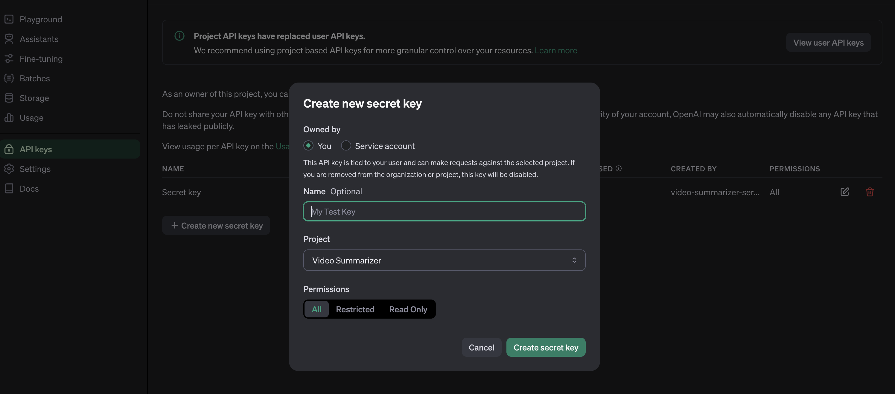
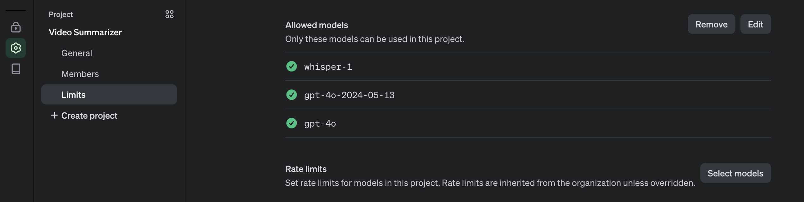

# Building Video Summarizer Using AI


With the recent advancements in AI technology, such as OpenAI, it has become possible to automate tasks that were previously too tedious to perform manually. An example of this is a video summarizer. Previously, the process of summarizing video content relied mainly on human vision and hearing. However, with AI models such as [GPT-4](https://platform.openai.com/docs/models/gpt-4-turbo-and-gpt-4) and [Whisper](https://platform.openai.com/docs/models/whisper), it is now possible to automate this task.

We will be utilizing the following technologies: OpenAI, Node.js, React, and GridDB. This blog will teach you how to create a basic web application for uploading a video and receiving a summary of the content.

## Getting Started

This project running on Ubuntu 22.04 LTS. These are the mandatory stack requirements that you need to run for this project:

### OpenAI Key

To access any OpenAI services, we need a valid key. Go to this [link](https://platform.openai.com/api-keys) and create a new OpenAI key.



The OpenAI key is on a project basis, so we need to create a project first in the OpenAI platform and you need also to enable any models that you use on a project. For this project we will need `gpt-4o` and `whisper` models.



The OpenAI key will be saved on the `.env` file and make sure not to include it in version control by adding it to the `.gitignore`.

### Node.js

This project will run on the Node.js platform. You need to install it from [here](https://nodejs.org/en/download). For this project, we will use the `nvm` package manager and Node.js v20.13.1
LTS version.

```shell
# installs nvm (Node Version Manager)
curl -o- https://raw.githubusercontent.com/nvm-sh/nvm/v0.39.7/install.sh | bash

# download and install Node.js
nvm install 20

# verifies the right Node.js version is in the environment
node -v # should print `v20.13.1`

# verifies the right NPM version is in the environment
npm -v # should print `10.5.2`
```

### GridDB

To save the video summary and video data, we will use the GridDB database. Please look at the [guide](https://docs.griddb.net/latest/gettingstarted/using-apt/#install-with-apt-get) for detailed installation. We will use Ubuntu 22.04 LTS here.

Run GridDB and check if the service is running. Use this command:

```shell
sudo systemctl status gridstore
```

If not running try to run the database with this command:

```shell
sudo systemctl start gridstore
```

## Run the Project

### Pull the Source Code

To run the project, you need to clone the code from this [repository](https://github.com/junwatu/video-summarizer-nodejs-griddb).

Run this command to pull the source code.

```shell
git clone https://github.com/junwatu/video-summarizer-nodejs-griddb.git
```

Change the directory to the `app` folder and install any project dependencies using this command:

```shell
cd video-summarizer-nodejs-griddb
npm install
```

### Setup `.env`

This project needs a few environment variables. Copy the `env.example` file to the `.env` file.

```shell
cp .env.example .env
```

You need to fill in the environment variables in this file:

```ini
OPENAI_API_KEY=sk-....
VITE_API_URL=http://localhost:3000
```

It is important to note that the project must be restarted every time you change the `VITE_API_URL` environment variable.

### Start the Project

Run this command to run the project:

```shell
npm run start:build
```

## How it Works?

This project uses the GPT-4o and Whisper models from OpenAI to summarize the uploaded user video. It requires two models because OpenAI models cannot process video directly, but they can process images or audio files. In Node.js to separate the video into images and audio files, you can use the [`fluent-ffmpeg`](https://www.npmjs.com/package/fluent-ffmpeg) npm package.

### Video Processing

While it's not possible to directly send a video to the API, GPT-4o can understand videos if you sample frames and then provide them as images. It performs better at this task than the earlier GPT-4 Turbo model.

This function, `extractFrames()`, will extract images from the video file and save them in the uploads folder.

```js
export function extractFrames(videoPath, secondsPerFrame, outputFolder) {
    return new Promise((resolve, reject) => {
        const frameRate = 1 / secondsPerFrame
        const framePattern = path.join(outputFolder, 'frame-%03d.png')

        ffmpeg(videoPath)
            .outputOptions([`-vf fps=${frameRate}`])
            .output(framePattern)
            .on('end', () => {
                fs.readdir(outputFolder, (err, files) => {
                    if (err) {
                        reject(err)
                    } else {
                        const framePaths = files.map(file => path.join(outputFolder, file))
                        resolve(framePaths)
                    }
                })
            })
            .on('error', reject)
            .run()
    })
}
```

### Image Processing

The GPT-4o model can directly process images and take intelligent actions based on the image. We can provide images in two formats:

- Base64 Encoded
- URL

In this project, we will utilize base64 encoding for the images.

```js
// Function to convert an image file to base64 using Buffer
export function imageToBase64(imagePath) {
    return new Promise((resolve, reject) => {
        fs.readFile(imagePath, (err, data) => {
            if (err) {
                reject(err)
            } else {
                const base64String = data.toString('base64')
                resolve(base64String)
            }
        })
    })
}
```
