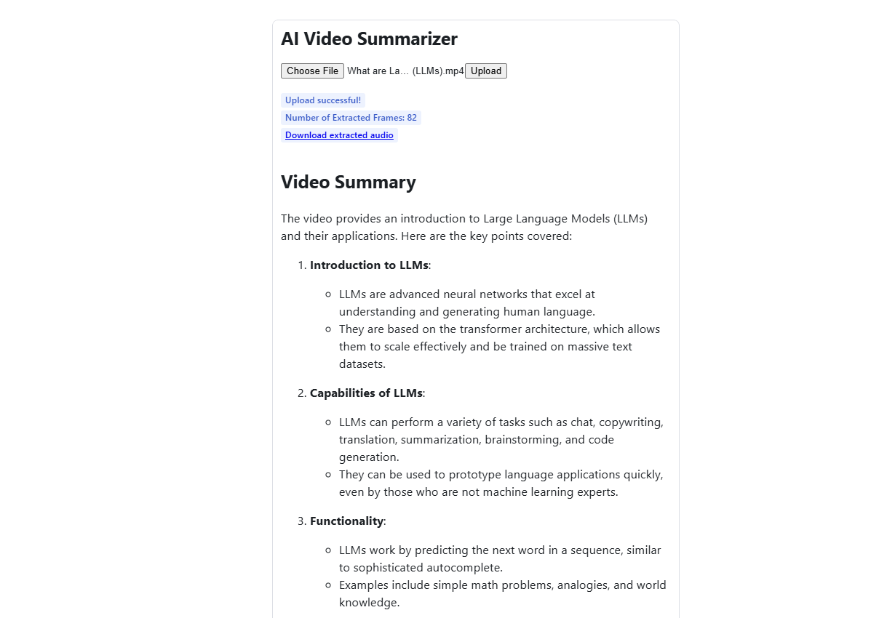
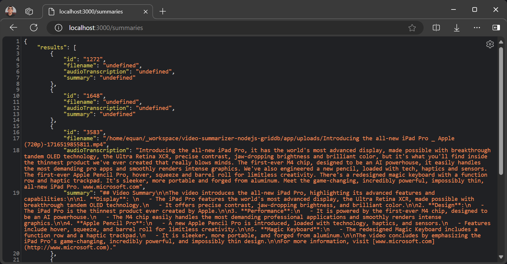

# Building Video Summarizer Using AI


With the recent advancements in AI technology, such as OpenAI, it has become possible to automate tasks that were previously too tedious to perform manually. An example of this is a video summarizer. Previously, the process of summarizing video content relied mainly on human vision and hearing. However, with AI models such as [GPT-4](https://platform.openai.com/docs/models/gpt-4-turbo-and-gpt-4) and [Whisper](https://platform.openai.com/docs/models/whisper), it is now possible to automate this task.

We will be utilizing the following technologies: OpenAI, Node.js, React, and GridDB. This blog will teach you how to create a basic web application for uploading a video and receiving a summary of the content.

## Getting Started

This project running on Ubuntu 22.04 LTS. These are the mandatory stack requirements that you need to run for this project:

### OpenAI Key

To access any OpenAI services, we need a valid key. Go to this [link](https://platform.openai.com/api-keys) and create a new OpenAI key.


The OpenAI key is on a project basis, so we need to create a project first in the OpenAI platform and you need also to enable any models that you use on a project. For this project, we will need `gpt-4o` and `whisper` models.


The OpenAI key will be saved on the `.env` file and make sure not to include it in version control by adding it to the `.gitignore`.

### Node.js

This project will run on the Node.js platform. You need to install it from [here](https://nodejs.org/en/download). For this project, we will use the `nvm` package manager and Node.js v16.20.2
LTS version.

```shell
# installs nvm (Node Version Manager)
curl -o- https://raw.githubusercontent.com/nvm-sh/nvm/v0.39.7/install.sh | bash

# download and install Node.js
nvm install 16

# verifies the right Node.js version is in the environment
node -v # should print `v16.20.2`

# verifies the right NPM version is in the environment
npm -v # should print `8.19.4``
```

To connect Node.js and GridDB database, you need the [gridb-node-api](https://github.com/nodejs/node-addon-api) npm package which is a Node.js binding developed using GridDB C Client and Node addon API.

### FFmpeg

This project utilizes the [`fluent-ffmpeg`](https://www.npmjs.com/package/fluent-ffmpeg) npm package, which requires FFmpeg to be installed on the system. For Ubuntu, you can use the following command to install it:

```shell
sudo apt update
sudo apt install ffmpeg
```

For more installation information, please go to the [FFmpeg official website](https://ffmpeg.org/).

### GridDB

To save the video summary and video data, we will use the GridDB database. Please look at the [guide](https://docs.griddb.net/latest/gettingstarted/using-apt/#install-with-apt-get) for detailed installation. We will use Ubuntu 20.04 LTS here.

Run GridDB and check if the service is running. Use this command:

```shell
sudo systemctl status gridstore
```

If not running try to run the database with this command:

```shell
sudo systemctl start gridstore
```

## Run the Project

### Pull the Source Code

To run the project, you need to clone the code from this [repository](https://github.com/junwatu/video-summarizer-nodejs-griddb).

Run this command to pull the source code.

```shell
git clone https://github.com/junwatu/video-summarizer-nodejs-griddb.git
```

Change the directory to the `app` folder and install any project dependencies using this command:

```shell
cd video-summarizer-nodejs-griddb
npm install
```

### Setup `.env`

This project needs a few environment variables. Copy the `env.example` file to the `.env` file.

```shell
cp .env .example .env
```

You need to fill in the environment variables in this file:

```ini
OPENAI_API_KEY=sk-....
VITE_API_URL=http://localhost:3000
```

It is important to note that the project must be restarted every time you change the `VITE_API_URL` environment variable.

### Start the Project

Run this command to run the project:

```shell
npm run start:build
```

### Open Web App

Open the web app using the browser. The default URL is `http://localhost:3000`. Upload any videos and it's recommended to upload a short video for fast processing. You can also use the video in the `test/video` folder. Depending on the video duration, it will take a minute to process.



## How it Works?

The user flow for this project or web app involves opening the web app, uploading the video, waiting for processing, and receiving the summary result. It uses the GPT-4o and Whisper models from OpenAI to summarize the uploaded user video. This project requires two models because OpenAI models cannot process video directly, however they can process images or audio files. On the other side, in Node.js, to separate the video into images and audio files, we use the [`fluent-ffmpeg`](https://www.npmjs.com/package/fluent-ffmpeg) npm package.

These are the primary preparation steps for videos before we input them into OpenAI models for the summarization process.

### 1. Video Processing

While it's not possible to directly send a video to the API, GPT-4o can understand videos if you sample frames and then provide them as images. It performs better at this task than the earlier GPT-4 Turbo model.

This function, `extractFrames()`, will extract images from the video file and save them in the `frames` folder.

```js
export function extractFrames(videoPath, secondsPerFrame, outputFolder) {
    return new Promise((resolve, reject) => {
        const frameRate = 1 / secondsPerFrame
        const framePattern = path.join(outputFolder, 'frame-%03d.png')

        ffmpeg(videoPath)
            .outputOptions([`-vf fps=${frameRate}`])
            .output(framePattern)
            .on('end', () => {
                fs.readdir(outputFolder, (err, files) => {
                    if (err) {
                        reject(err)
                    } else {
                        const framePaths = files.map(file => path.join(outputFolder, file))
                        resolve(framePaths)
                    }
                })
            })
            .on('error', reject)
            .run()
    })
}
```

In the function `extractFrames`, the parameter `secondsPerFrame` defines the interval between frames that you want to extract from the video. Specifically, `secondsPerFrame` determines how many seconds should elapse between each frame that is extracted.

Here’s how it works:

Frame Rate Calculation: The frame rate is calculated as the reciprocal of secondsPerFrame, i.e., frameRate = 1 / secondsPerFrame. This means:

• If secondsPerFrame is 1, the frame rate is 1 frame per second.
• If secondsPerFrame is 0.5, the frame rate is 2 frames per second.
• If secondsPerFrame is 2, the frame rate is 0.5 frames per second (one frame every 2 seconds).


### 2. Image Processing

The GPT-4o model can directly process images and take intelligent actions based on the image. We can provide images in two formats:

- Base64 Encoded
- URL

In this project, we will use base64 encoding for the images. The function `imageToBase64()` will read each image file and convert it into a base64 encoded image.

```js
export function imageToBase64(imagePath) {
    return new Promise((resolve, reject) => {
        fs.readFile(imagePath, (err, data) => {
            if (err) {
                reject(err)
            } else {
                const base64String = data.toString('base64')
                resolve(base64String)
            }
        })
    })
}
```

### 3. Audio Extraction

For a better context summarization, we can add audio to the OpenAI model. To extract audio from video, we can also use the `fluent-ffmpeg` npm. The audio result is in `mp3` format and saved in the `audio` directory.

```js
// Function to extract audio from video
export function extractAudio(videoPath, audioPath) {
    return new Promise((resolve, reject) => {
        ffmpeg(videoPath)
            .output(audioPath)
            .audioBitrate('32k')
            .on('end', resolve)
            .on('error', reject)
            .run()
    })
}
```

### 4. Audio Transcription

After extracting the audio, we need to transcribe it into text using the speech-to-text model Whisper. 

```js
async function transcribeAudio(filePath) {
	try {
		const transcription = await openai.audio.transcriptions.create({
			file: fs.createReadStream(filePath),
			model: 'whisper-1'
		})
		return transcription.text
	} catch (error) {
		throw new Error(`Transcription failed: ${error.message}`)
	}
}
```

The `transcribeAudio()` will transcribe an audio file to text using the `whisper-1` AI model. For more information about how this speech-to-text model works, please read [here](https://openai.com/index/whisper/).

> The code for video processing, image processing, and audio extraction can be found in the file `libs/videoProcessing.js`.

## Video Summarization Process

The video summary is created by inputting both the visual and audio transcription elements of the video into the model simultaneously. By providing both of these inputs, the model is expected to produce a more accurate summary as it can perceive the entire video at once.

```js
// Generate a summary with visual and audio transcription
import OpenAI from "openai";

const openai = new OpenAI({
    // eslint-disable-next-line no-undef
    apiKey: process.env.OPENAI_API_KEY
});

async function createVideoSummarization(frames, audioTranscription) {
    const frameObjects = frames.map(x => ({
        type: 'image_url',
        image_url: {
            url: `data:image/jpg; base64, ${x}`,
            detail: 'low'
        }
    }));

    const response = await openai.chat.completions.create({
        model: "gpt-4o",
        messages: [{
                role: "system",
                content: "You are generating a video summary. Please provide a summary of the video. Respond in Markdown."
            }
            ,
            {
                role: "user",
                content: [{
                        type: 'text',
                        text: "These are the frames from the video."
                    }
                    ,
                    ...frameObjects,
                    {
                        type: 'text',
                        text: `The audio transcription is: ${audioTranscription}`
                    }
                ],
            }
            ,
        ],
        temperature: 0,
    });
    console.log(response.choices[0].message.content);
    return response;
}

export { createVideoSummarization }
```

The `content` parameter is an array and may contain text or images. Prompts can be added to summarize the video, as image frames addition, and audio text transcription for better context. You can look into the [Chat API](https://platform.openai.com/docs/api-reference/chat/create) documentation for more information.

## Save Video Summary to GridDB

The GridDB database is utilized to store the video summary, video file path, and audio transcription. The code to save these data resides in the `griddbservices.js` file.

```js
export async function saveData({ filename, audioTranscription, summary }) {
    const id = generateRandomID();
    const videoFilename = String(filename);
    const audioToText = String(audioTranscription);
    const videoSummary = String(summary);

    const packetInfo = [parseInt(id), videoFilename, audioToText, videoSummary];
    const saveStatus = await GridDB.insert(packetInfo, collectionDb);
    return saveStatus;
}
```

There are three important fields here, which are:

| Parameter          | Type   | Description                                 |
|--------------------|--------|---------------------------------------------|
| `filename`         | String | The name of the video file.                 |
| `audioTranscription` | String | The transcription of the audio from the video. |
| `summary`          | String | A summary of the video content.             |

## Get All Summaries

All the summaries data can be accessed in the route `/summaries`. The default URL is:

```shell
http://localhost:3000/summaries
```

The response is JSON data, which is very easy to process on the client if you need further features or enhancements for the project.  



## Limitation

This project is a prototype and tested with MP4 videos with a video duration not exceeding 5 minutes.
